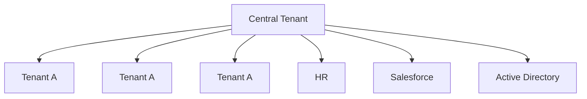

<figure>

A diagram illustrating a mesh integration within various systems. At the center, there is a primary geometric-shaped logo connected to several smaller instances of a similar logo, indicating multiple tenants. The central tenant integrates with HR systems, Salesforce, and Active Directory.

</figure>

# Mesh

While some companies centralize their users within a single tenant, others have a more decentralized structure with applications, HR systems, and Active Directory domains integrated into each tenant. Cross-tenant synchronization offers the flexibility to choose which users are provisioned into each tenant.

# Collaborate within a portfolio company (partial-mesh)

In this scenario, each tenant represents a different company within the same parent organization. Administrators in each tenant choose a subset of users to provision into the target tenant. This solution provides flexibility for each tenant to operate independently, while facilitating collaboration when users need access to critical resources.