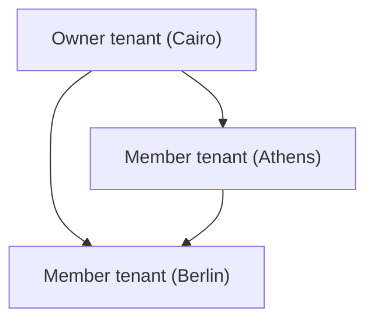

# Configure a multitenant organization using PowerShell or Microsoft Graph API

Article · 04/24/2024

This article describes the key steps to configure a multitenant organization using Microsoft Graph PowerShell or Microsoft Graph API. This article uses an example owner tenant named Cairo and two member tenants named Berlin and Athens.

If you instead want to use the Microsoft 365 admin center to configure a multitenant organization, see Set up a multitenant org in Microsoft 365 and Join or leave a multitenant organization in Microsoft 365. To learn how to configure Microsoft Teams for your multitenant organization, see The new Microsoft Teams desktop client.

# Prerequisites

## Owner tenant

· For license information, see License requirements.

· Security Administrator role to configure cross-tenant access settings and templates for the multitenant organization.

· Global Administrator role to consent to required permissions.
