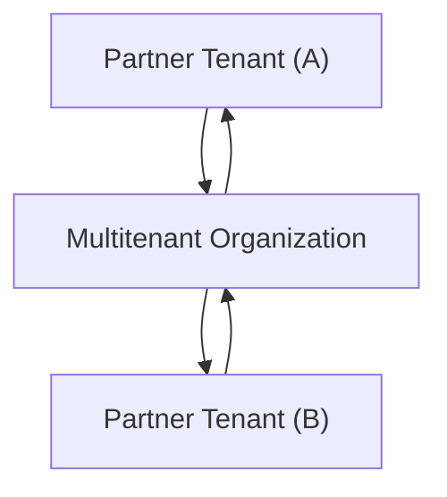

Configure multitenant organization policy templates using the Microsoft Graph API
===

Article · 04/24/2024

This article describes how to configure a policy template for your multitenant organization.

# Prerequisites

· For license information, see License requirements.

· Security Administrator role to configure cross-tenant access settings and templates for the multitenant organization.

· Global Administrator role to consent to required permissions.

# Cross-tenant access policy partner template

The cross-tenant access partner configuration handles trust settings and automatic user consent settings between partner tenants. For example, you can use these settings to trust multifactor authentication claims for inbound users from the target partner tenant. With the template in an unconfigured state, partner configurations for partner tenants in the multitenant organization won't be amended, with all trust settings passed through from default settings. However, if you configure the template, then partner configurations will be amended corresponding to the policy template.

### Figure Description

The figure illustrates the flow of trust settings and automatic user consent settings between partner tenants within a multitenant organization, managed by the cross-tenant access partner configuration.

# Configure inbound and outbound automatic redemption

To specify which trust settings and automatic user consent settings to apply to your policy template, use the Update multiTenantOrganizationPartnerConfigurationTemplate API. If you create or join a multitenant organization using the Microsoft 365 admin center, this configuration is handled automatically.

Request

HTTP

PATCH

https://graph.microsoft.com/beta/policies/crossTenantAccessPolicy/templates/multiTenantOrganizationPartnerConfiguration