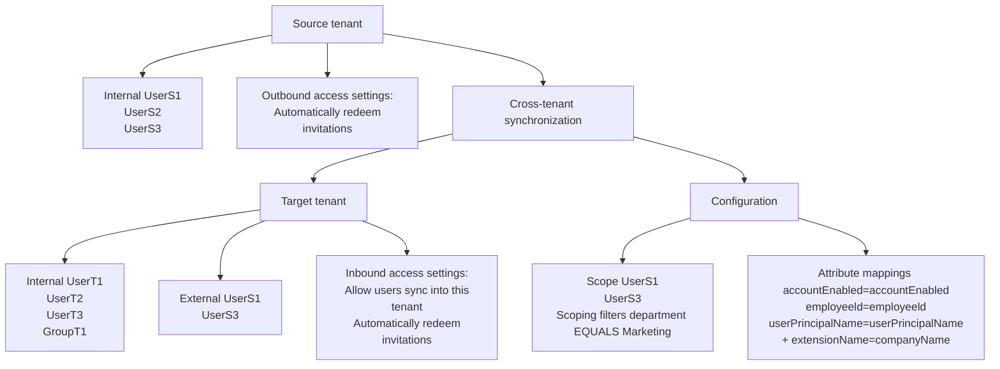

Configure cross-tenant synchronization
===

Article · 03/11/2024

This article describes the steps to configure cross-tenant synchronization using the Microsoft Entra admin center. When configured, Microsoft Entra ID automatically provisions and de-provisions B2B users in your target tenant. For important details on what this service does, how it works, and frequently asked questions, see Automate user provisioning and deprovisioning to SaaS applications with Microsoft Entra ID.

[Diagram illustrating the cross-tenant synchronization process between the Source tenant and Target tenant. The Source tenant has internal users UserS1, UserS2, and UserS3 and is configured to automatically redeem invitations for outbound access settings. The Target tenant has internal users UserT1, UserT2, UserT3, and GroupT1, and external users UserS1 and UserS3 with inbound access settings allowing users to sync into this tenant and automatically redeem invitations. Scoping filters and attribute mappings between these entities are also shown.]

# Learning objectives

By the end of this article, you'll be able to:

- Create B2B users in your target tenant
- Remove B2B users in your target tenant
- Keep user attributes synchronized between your source and target tenants

Prerequisites

[Visual representation of the source tenant]