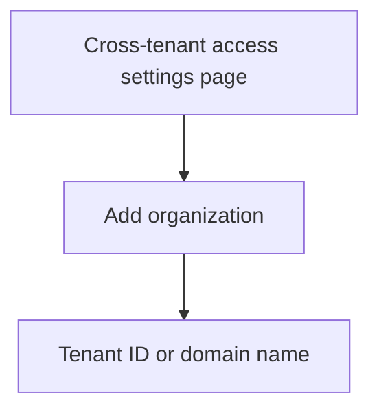

Step 4: Automatically redeem invitations in the source tenant
===

Source tenant

In this step, you automatically redeem invitations in the source tenant.

1. Sign in to the Microsoft Entra admin center of the source tenant.

2. Browse to Identity > External Identities > Cross-tenant access settings.

3. On the Organization settings tab, select Add organization.

4. Add the target tenant by typing the tenant ID or domain name and selecting Add.

5. Under Outbound access for the target organization, select Inherited from default.

6. Select the Trust settings tab.

7. Check the Automatically redeem invitations with the tenant <tenant> check box.