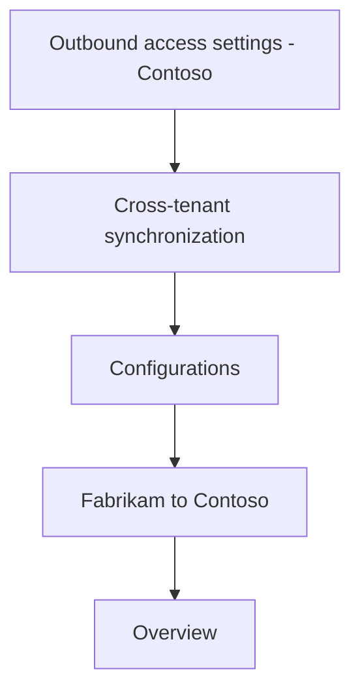
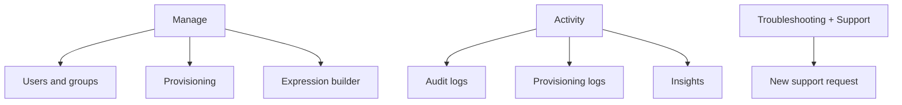
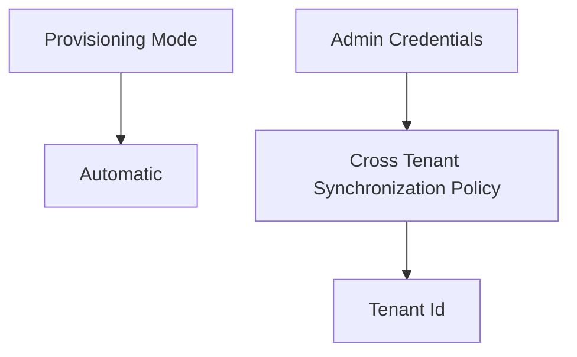
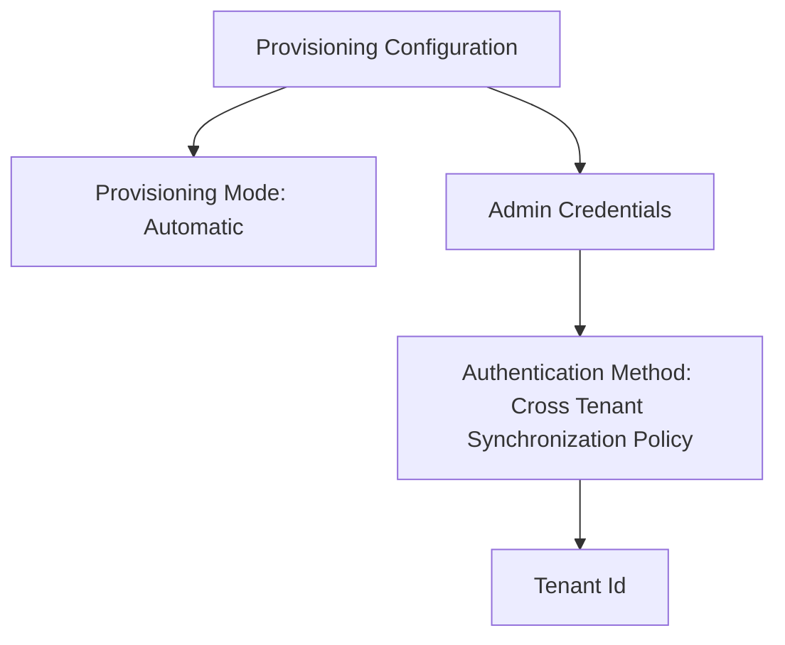

\> Outbound access settings - Contoso > Cross-tenant synchronization | Configurations >

Description: A screenshot displaying the outbound access settings in a Microsoft Entra admin center, showing the navigation path and a dropdown menu with various settings categories.

Fabrikam to Contoso Fabrikam - Microsoft Entra ID

Overview
 ✅
X

«

Got feedback?

Overview

Provision on demand

Manage

Users and groups

Provisioning

Expression builder

Activity

Audit logs

Provisioning logs

Insights

Troubleshooting + Support

New support request

Description: A pane from the Microsoft Entra admin center showing options for managing identity lifecycle, including user provisioning and audit logs. An illustration promotes automating identity lifecycle management.

Automate identity lifecycle management with Microsoft Entra

Automatically create, update, and delete accounts when users join, leave, and move within your organization. Learn more.

Get started

What is provisioning? Plan an application deployment. +

Configure automatic provisioning.

Description: A screenshot showing provisioning instructions with a focus on setting the provisioning mode to automatic and configuring admin credentials for cross-tenant synchronization policy.

2. Select Get started.

3. Set the Provisioning Mode to Automatic.

4. Under the Admin Credentials section, change the Authentication Method to Cross Tenant Synchronization Policy.

Description: A screenshot of the provisioning configuration page in the Microsoft Entra admin center. The Provisioning Mode is set to Automatic, and the Authentication Method is set to Cross Tenant Synchronization Policy. There is a Tenant Id field and an option to Test Connection.

