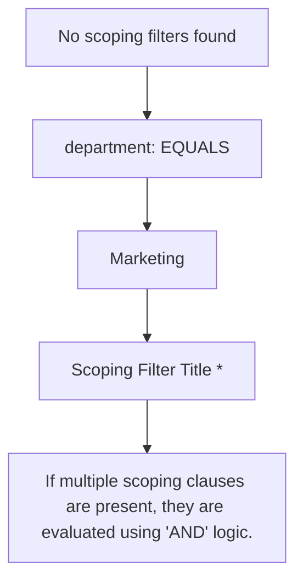
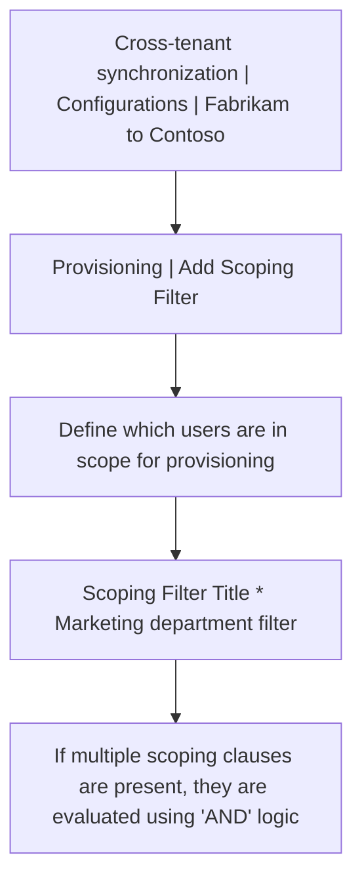

To configure scoping filters, refer to the instructions provided in Scoping users or groups to be provisioned with scoping filters.

| Target Attribute | Operator | | Value | Add/Remove |
| - | - | - | - | - |
| No scoping filters found | | | | |
| department ✅ | EQUALS | ✅ | Marketing | Add New Scoping Clause |

6\. Select Ok and Save to save any changes.

If you added a filter, you'll see a message that saving your changes will result in all assigned users and groups being resynchronized. This may take a long time depending on the size of your directory.

7\. Select Yes and close the Attribute Mapping page.

# Step 9: Review attribute mappings

<figure>

*An image showing an interface for adding a scoping filter. There are fields for Target Attribute, Operator, Value, and Add/Remove. The "Marketing department filter" and "EQUALS" operator are selected.*

</figure>

## Source tenant

Attribute mappings allow you to define how data should flow between the source tenant and target tenant. For information on how to customize the default attribute mappings, see Tutorial - Customize user provisioning attribute-mappings for SaaS applications in Microsoft Entra ID.

1\. In the source tenant, select Provisioning and expand the Mappings section.

2\. Select Provision Microsoft Entra ID Users.

3\. On the Attribute Mapping page, scroll down to review the user attributes that are synchronized between tenants in the Attribute Mappings section.

<figure>

*An image showing the Cross-tenant Synchronization configurations from Fabrikam to Contoso under the Provisioning section. There's a section for adding scoping filters with the title "Marketing department filter".*

</figure>