The first attribute, alternativeSecurityIdentifier, is an internal attribute used to uniquely identify the user across tenants, match users in the source tenant with existing users in the target tenant, and ensure that each user only has one account. The matching attribute cannot be changed. Attempting to change the matching attribute or adding additional matching attributes will result in a schemaInvalid error.

<figure>

Attribute Mapping

**Attribute mappings** define how attributes are synchronized between Azure Active Directory and Azure Active Directory (target tenant)

| Azure Active Directory Attribute           | Azure Active Directory (target tenant) Attribute | Matching precedence | Remove | |
|--------------------------------------------|-------------------------------------------------|---------------------|--------| - |
| AltSecldFromNetid([netid])                 | alternativeSecuritylds                          | 1                   | Delete | |
| IsSoftDeleted                              | IsSoftDeleted                                   |                     | Delete | |
| accountEnabled                             | accountEnabled                                  |                     | Delete | |
| streetAddress                              | streetAddress                                   |                     | Delete | |
| city                                       | city                                            |                     | Delete | |
| state                                      | state                                           |                     | Delete | |
| postalCode                                 | postalCode                                      |                     | Delete | |
| country                                    | country                                         |                     | Delete | |
| department                                 | department                                      |                     | Delete | |
| employeeld                                 | employeeld                                      |                     | Delete | + |
| displayName                                | displayName                                     |                     | Delete | |
| givenName                                  | givenName                                       |                     | Delete | |

```mermaid
graph TD;
    AzureAD["Azure Active Directory Attribute"] -->|Matches with| AltSecldFromNetid["AltSecldFromNetid([netid])"]
    AzureAD["Azure Active Directory Attribute"] -->|Matches with| IsSoftDeleted["IsSoftDeleted"]
    AzureAD["Azure Active Directory Attribute"] -->|Matches with| accountEnabled["accountEnabled"]
    AzureAD["Azure Active Directory Attribute"] -->|Matches with| streetAddress["streetAddress"]
    AzureAD["Azure Active Directory Attribute"] -->|Matches with| city["city"]
    AzureAD["Azure Active Directory Attribute"] -->|Matches with| state["state"]
    AzureAD["Azure Active Directory Attribute"] -->|Matches with| postalCode["postalCode"]
    AzureAD["Azure Active Directory Attribute"] -->|Matches with| country["country"]
    AzureAD["Azure Active Directory Attribute"] -->|Matches with| department["department"]
    AzureAD["Azure Active Directory Attribute"] -->|Matches with| employeeld["employeeld"]
    AzureAD["Azure Active Directory Attribute"] -->|Matches with| displayName["displayName"]
    AzureAD["Azure Active Directory Attribute"] -->|Matches with| givenName["givenName"]
```

</figure>



4. Select the Member (userType) attribute to open the Edit Attribute page.

5. Review the Constant Value setting for the userType attribute.

This setting defines the type of user that will be created in the target tenant and can be one of the values in the following table. By default, users will be created as external member (B2B collaboration users). For more information, see Properties of a Microsoft Entra B2B collaboration user.

  
| Constant Value | Description |
| - | - |
| Member | Default. Users will be created as external member (B2B collaboration users) in the target tenant. Users will be able to function as any internal member of the target tenant. |
| Guest | Users will be created as external guests (B2B collaboration users) in the target tenant. |
  

```mermaid
graph TD;
    userType[Member("Default. Users will be created as external member (B2B collaboration users) in the target tenant. Users will be able to function as any internal member of the target tenant.")]
    userType2("Guest")["Users will be created as external guests (B2B collaboration users) in the target tenant."]
```