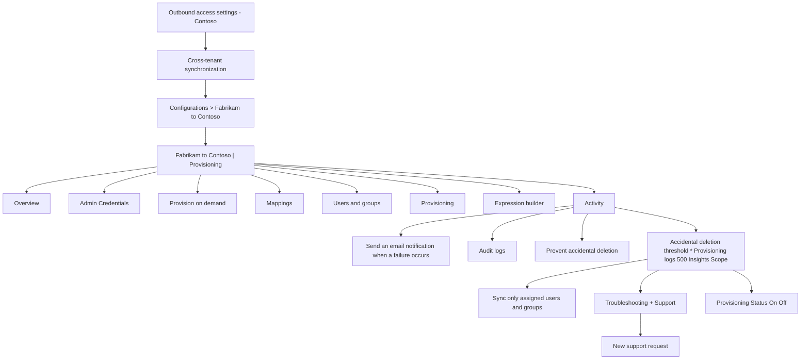

1. In the source tenant, select Provisioning and expand the Settings section.

![Outbound access settings - Contoso > Cross-tenant synchronization | Configurations > Fabrikam to Contoso Fabrikam to Contoso | Provisioning Fabrikam - Microsoft Entra ID ✅ « ❌ Save ✅ Discard Overview v Admin Credentials Provision on demand Manage V Mappings Users and groups Provisioning Settings Expression builder Activity ❌ Send an email notification when a failure occurs Audit logs ✅ Prevent accidental deletion 0 Accidental deletion threshold \* Provisioning logs 500 Insights Scope ❌ Sync only assigned users and groups V Troubleshooting + Support New support request Provisioning Status O On Off +" ](figures/0)

2. Check the Send an email notification when a failure occurs check box.

3. In the Notification Email box, enter the email address of a person or group who should receive provisioning error notifications.

Email notifications are sent within 24 hours of the job entering quarantine state. For custom alerts, see Understand how provisioning integrates with Azure Monitor logs.

4. To prevent accidental deletion, select Prevent accidental deletion and specify a threshold value. By default, the threshold is set to 500.

For more information, see Enable accidental deletions prevention in the Microsoft Entra provisioning service.

5. Select Save to save any changes.

Step 11: Test provision on demand

 

Source tenant