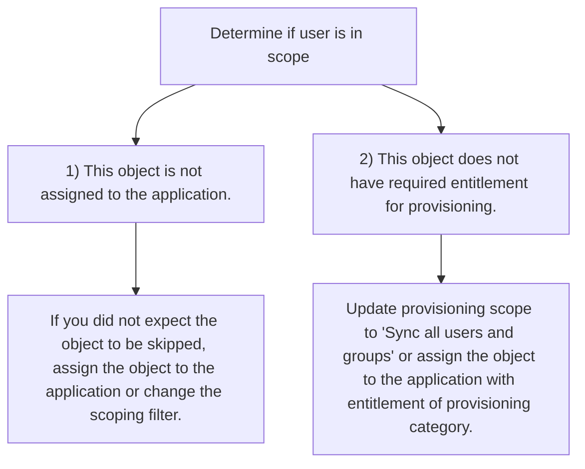

<!-- PageNumber="X" -->

# Perform action

Modified attributes (successful) Data flow

User 'user1@fabrikam.com' was created in Azure Active Directory (target tenant)

Ma

Act

\-

Tro

| Target attribute name | Source attribute value | Expression | Original target attribute v ... | Modified target attribute value |
| - | - | - | - | - |
| IsSoftDeleted | False | [IsSoftDeleted] | | False |
| accountEnabled | True | [accountEnabled] | | True |
| displayName | User1 | [displayName] | | User1 |
| mailNickname | user1 | [mailNickname] | | user1 |
| alternativeSecuritylds | AltSecldFromNetid("1003 ... | AltSecldFromNetid([netid]) | | (1 values) |
| showInAddressList | "true" | "true" | | true |
| userType | "Member" | "Member" | | Member |
| preferredLanguage | undefined | [preferredLanguage] | | en-US |

\+

# If the user isn't in scope, you'll see a page with information about why test user was skipped.

*Image description: A screenshot of a user interface explaining that the user 'alice@fabrikam.com' will be skipped due to specific reasons such as the object not being assigned to the application and not having the required entitlement for provisioning.*

| Attribute name | Attribute value |
| - | - |
| SkipReason | NotEffectivelyEntitled |
| IsActive | True |
| Assigned to the application | False |
| IsInProvisioningScope | True |
| | + |

On the Provision on demand page, you can view details about the provision and have the option to retry.