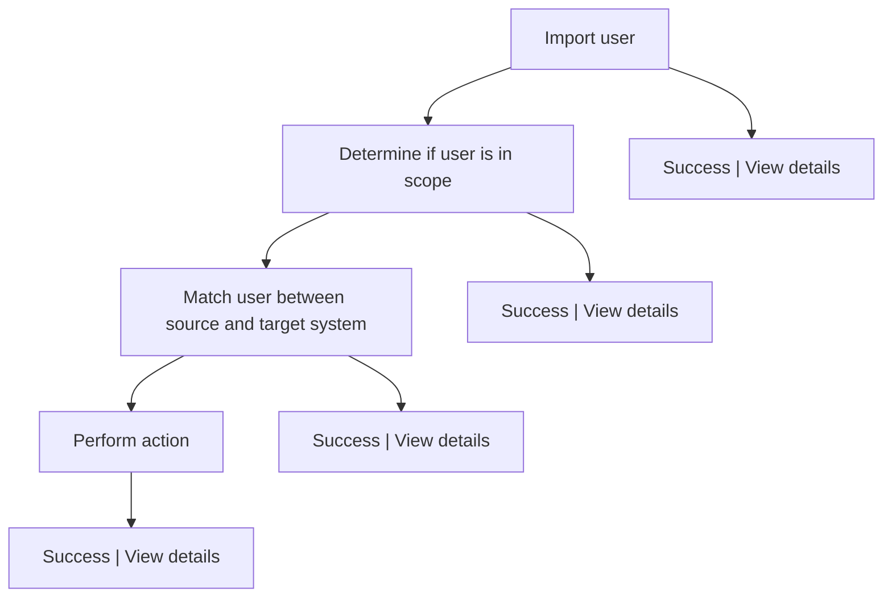
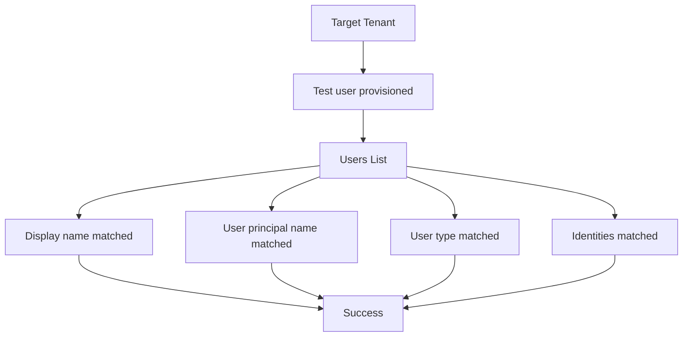

✅
... > Fabrikam to Contoso | Provisioning > Cross-tenant synchronization | Configurations > Fabrikam to Contoso
===

<figure>

Figure 1: Fabrikam to Contoso | Provision on demand Fabrikam - Microsoft Entra ID

</figure>

X

<figure>

Figure 2: Learn More Technical details Got feedback? 1 Overview Ps Provision on demand User Manage US User1 user1@fabrikam.com Users and groups Provisioning Expression builder 1. Import user This step shows the user retrieved from the source system and the properties of the user in the source system. Activity ✅ Success | View details Audit logs Provisioning logs 2. Determine if user is in scope Insights This step shows the scoping conditions that were evaluated and which ones the user passed or failed. Troubleshooting + Support ✅ Success | View details New support request 3. Match user between source and target system This step shows whether the user was found in the target system as well as the properties of the user in the target system. ✅ Success | View details 4. Perform action This step shows the action that was performed in the target application, such as creating a user or updating a user. Success | View details ✅ + Retry Provision another object

</figure>

## 6\. In the target tenant, verify that the test user was provisioned.

<figure>

Figure 3: Home > Contoso > Users ... × Contoso - Microsoft Entra ID Search « + New user V Download users Bulk operations V Refresh V Manage view Delete Per-user MFA .... All users O Azure Active Directory is now Microsoft Entra ID. 2 Audit logs user1 ✅ ✅ Add filter Sign-in logs 1 user found \* Diagnose and solve problems ❌ Display name 1l User principal name 1l User type On-premises ... Identities Company name Creation type Manage ❌ US User1 user1\_fabrikam.com#EXT#@ ... ✅ Member No ExternalAzureAD Invitation Deleted users Password reset User settings + % Bulk operation results Troubleshooting + Support

</figure>

7\. If all is working as expected, assign additional users to the configuration.

For more information, see On-demand provisioning in Microsoft Entra ID.

Step 12: Start the provisioning job
✅