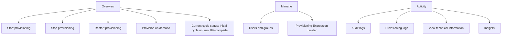

Source tenant
===

The provisioning job starts the initial synchronization cycle of all users defined in Scope of the Settings section. The initial cycle takes longer to perform than subsequent cycles, which occur approximately every 40 minutes as long as the Microsoft Entra provisioning service is running.

1. In the source tenant, browse to Identity > External Identities > Cross-tenant synchronization.

2. Select Configurations and then select your configuration.

3. On the Overview page, review the provisioning details.

![Fabrikam to Contoso | Provisioning > Cross-tenant synchronization | Configurations > i Fabrikam to Contoso Fabrikam - Microsoft Entra ID Overview .. X ✅ « ✅ Start provisioning ❌ Stop provisioning Restart provisioning ... Overview % Provision on demand Current cycle status Manage Initial cycle not run. Users and groups 0% complete Provisioning Expression builder View provisioning logs Activity Statistics to date Audit logs ✅ v View provisioning details Provisioning logs ✅ V View technical information + Insights](figures/1)

4. Select Start provisioning to start the provisioning job.

## Step 13: Monitor provisioning

Source and target tenants

Once you've started a provisioning job, you can monitor the status.

1. In the source tenant, on the Overview page, check the progress bar to see the status of the provisioning cycle and how close it's to completion. For more information, see Check the status of user provisioning.

