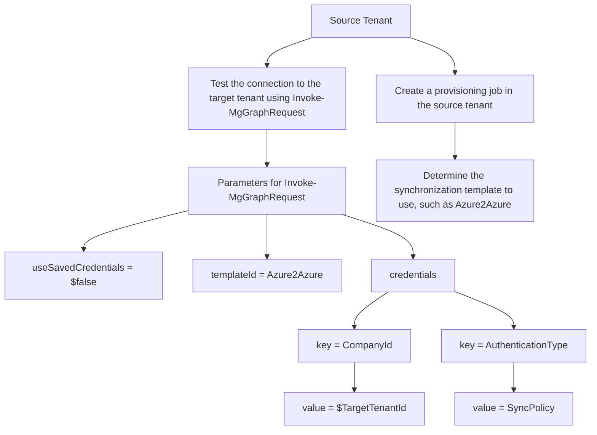

Step 7: Test the connection to the target tenant
===

Source tenant

PowerShell

1. In the source tenant, use the Invoke-MgGraphRequest command to test the connection to the target tenant and validate the credentials.

**Description**: Screenshot of a PowerShell script validating credentials using the Invoke-MgGraphRequest command. Below is the depicted script:
```
$Params = @{
    "useSavedCredentials"= $false
    "templateId" = "Azure2Azure"
    "credentials" = @(
        @{
            "key" = "CompanyId"
            "value" = $TargetTenantId
        }
        @{
            "key" = "AuthenticationType"
            "value" = "SyncPolicy"
        }
    )
}
Invoke-MgGraphRequest -Method POST -Uri "https://graph.microsoft.com/v1.0/servicePrincipals/$ServicePrincipalId/synchronization/jobs/validateCredentials" -Body $Params
```

Step 8: Create a provisioning job in the source tenant
===

Source tenant

In the source tenant, to enable provisioning, create a provisioning job.

PowerShell

1. Determine the synchronization template to use, such as Azure2Azure.

**Description**: Screenshot of a PowerShell script instruction guiding the user to determine the synchronization template, such as Azure2Azure. 

