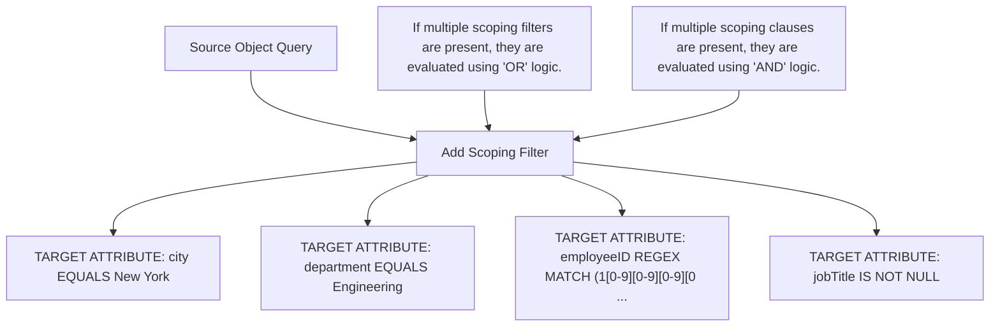

By default, Microsoft Entra provisioning connectors don't have any attribute-based scoping filters configured.

Scoping filter construction
===

A scoping filter consists of one or more clauses. Clauses determine which users are allowed to pass through the scoping filter by evaluating each user's attributes. For example, you might have one clause that requires that a user's "State" attribute equals "New York", so only New York users are provisioned into the application.

A single clause defines a single condition for a single attribute value. If multiple clauses are created in a single scoping filter, they're evaluated together using "AND" logic. The "AND" logic means all clauses must evaluate to "true" in order for a user to be provisioned.

Finally, multiple scoping filters can be created for a single application. If multiple scoping filters are present, they're evaluated together by using "OR" logic. The "OR" logic means that if all the clauses in any of the configured scoping filters evaluate to "true", the user is provisioned.

Each user or group processed by the Microsoft Entra provisioning service is always evaluated individually against each scoping filter.

As an example, consider the following scoping filter:

Source Object Query: Define which users are in scope for provisioning. Only objects that meet the criteria below will be synchronized.
Add scoping filter:
- SCOPING FILTER GROUP: New York Engineering (Delete)

TARGET ATTRIBUTE | OPERATOR | VALUE | ACTION
---------------- | -------- | ----- | ------
city | EQUALS | New York | Delete
department | EQUALS | Engineering | Delete
employeeID (extension ...) | REGEX MATCH | (1[0-9][0-9][0-9][0-9][0 ... | Delete
jobTitle | IS NOT NULL | | Delete

If multiple scoping filters are present, they are evaluated using "OR" logic.
Add new scoping clause:
- Scoping Filter Title: New York Engineering

If multiple scoping clauses are present, they are evaluated using "AND" logic.

According to this scoping filter, users must satisfy the following criteria to be provisioned:

- They must be in New York.

