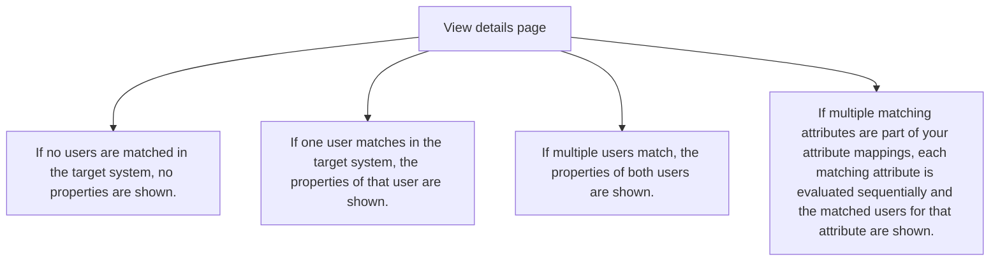

The View details section shows the scoping conditions that were evaluated. You might see one or more of the following properties:

- Active in source system indicates that the user has the property IsActive set to true in Microsoft Entra ID.

- Assigned to application indicates that the user is assigned to the application in Microsoft Entra ID.

- Scope sync all indicates that the scope setting allows all users and groups in the tenant.

- User has required role indicates that the user has the necessary roles to be provisioned into the application.

- Scoping filters are also shown if you have defined scoping filters for your application. The filter is displayed with the following format: {scoping filter title} {scoping filter attribute} {scoping filter operator} {scoping filter value}.

Figure description: A list of possible scoping conditions for users in Microsoft Entra ID, indicating their statuses like activeness, application assignment, scope setting, role requirement, and scoping filters.

# Troubleshooting tips

- Make sure that you've defined a valid scoping role. For example, avoid using the Greater_Than operator with a noninteger value.

- If the user doesn't have the necessary role, review the tips for provisioning users assigned to the default access role.

Figure description: Tips for troubleshooting issues related to scoping roles and required user roles.

# Step 4: Match user between source and target

In this step, the service attempts to match the user that was retrieved in the import step with a user in the target system.

# View details

The View details page shows the properties of the users that were matched in the target system. The context pane changes as follows:

- If no users are matched in the target system, no properties are shown.

- If one user matches in the target system, the properties of that user are shown.

- If multiple users match, the properties of both users are shown.

- If multiple matching attributes are part of your attribute mappings, each matching attribute is evaluated sequentially and the matched users for that attribute are shown.

Figure description: An explanation of how the View details page displays user properties depending on the number of matches in the target system.

