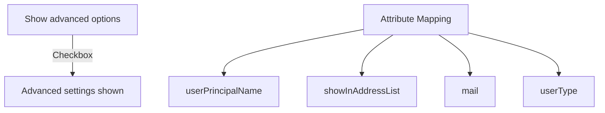
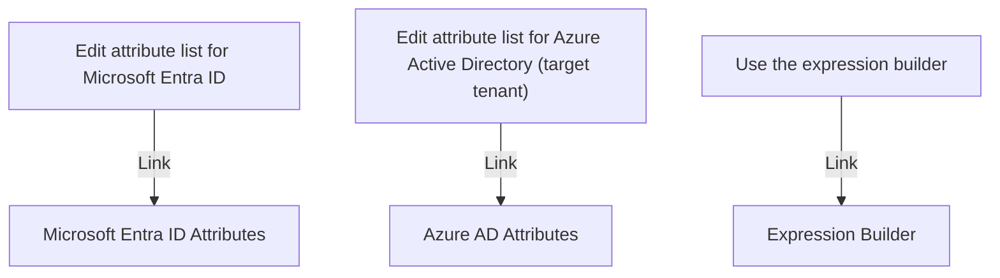

<!-- PageHeader="https://entra.microsoft.com/?" -->

Microsoft\_AAD\_Connect\_Provisioning\_forceSchemaEditorEnabled=true

2\. Browse to Identity > External Identities > Cross-tenant synchronization.

3\. Select Configurations and then select your configuration.

4\. Select Provisioning and expand the Mappings section.

5\. Select Provision Microsoft Entra ID Users to open the Attribute Mapping page.

6\. Scroll to the bottom and select the Show advanced settings check box.

Home > Cross-tenant synchronization | Configurations > Fabrikam to Contoso | Provisioning >

# Attribute Mapping

..
 ✅
X

| userPrincipalName | userPrincipalName | Delete | |
| - | - | - | - |
| true | showInAddressList | Delete | |
| mail | mail | Delete | |
| Member | userType | Delete | |

Add New Mapping
 ✅

***Screenshot of the Attribute Mapping page in Microsoft's admin center interface. It shows user attributes and their corresponding actions.***

Supported Attributes

View and edit the list of attributes that appear in the source and target attribute lists for this application.

Edit attribute list for Microsoft Entra ID

Edit attribute list for Azure Active Directory (target tenant)

Use the expression builder

***Screenshot showing buttons for editing the attribute list for Microsoft Entra ID and Azure Active Directory (target tenant)***

In addition to configuring your attribute mappings through the user interface, you can review, download, and edit the JSON of your schema. Review your schema here.

Tip

If you don't see the Edit attribute list links, be sure that you are signed in to the Microsoft Entra admin center using the link in Step 1.

7\. If you created a directory extension in the source tenant, select the Edit attribute list for Microsoft Entra ID link.

8\. If you created an extension in the target tenant, select the Edit attribute list for Azure Active Directory (target tenant) link.

9\. Add the directory extension and select the appropriate options.

Save ✅ Discard
❌ ❌