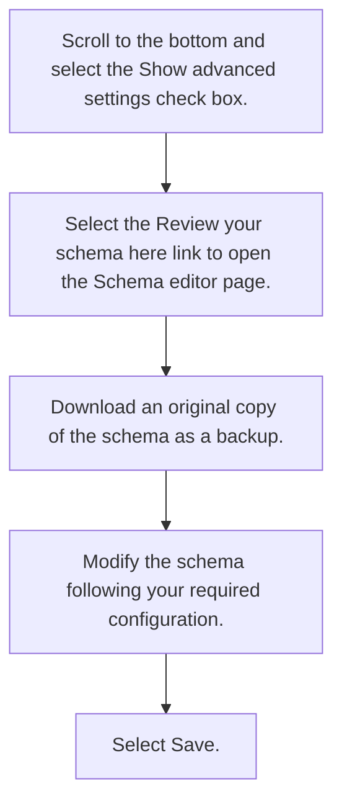

# 6. Scroll to the bottom and select the Show advanced settings check box.

Home > Cross-tenant synchronization | Configurations > Fabrikam to Contoso | Provisioning > Attribute Mapping

Save Discard

| userPrincipalName | userPrincipalName | Delete |
| - | - | - |
| true | showInAddressList | Delete |
| mail | mail | Delete |
| Member | userType | Delete |

Add New Mapping

Show advanced options

Supported Attributes

View and edit the list of attributes that appear in the source and target attribute lists for this application.

Edit attribute list for Microsoft Entra ID

Edit attribute list for Azure Active Directory (target tenant)

Use the expression builder

In addition to configuring your attribute mappings through the user interface, you can review, download, and edit the JSON representation of your schema. Review your schema here.

# 7. Select the Review your schema here link to open the Schema editor page.

Fabrikam to Contoso | Provisioning Attribute Mapping >

Schema editor

The schema below is a JSON representation of your provisioning configuration. You can use it to define what objects you want to provision, map objects between your source and target system, and specify who should be provisioned. We recommend making these changes directly through our configuration experience. The schema below is only used for saving your configuration and making changes in it.

We recommend downloading and saving the current configuration prior to making changes. A backup copy can be used to roll back to a known good state.

| - |
| 1 | | | |
| - | - | - | - | - | - |
| 2 | "@odata.context": "https://graph.microsoft.com/beta/$metadata#servicePril || | | |
| 3 | "id": "Azure2Azure. 1f58d1c91f90427abd849f967e96fb42.6a0b230b-3a8d-455d-9: || | | |
| 4 | "version": "v1.2", || | | |
| 5 | "synchronizationRules": [ || | | |
| 6 | { || | | |
| 7 | "containerFilter": null, || | |
| 8 | "editable": true, || | | |
| 9 | "groupFilter": null, || | |
| 10 | "id": "df8df8d1-9e6e-40d3-b8df-09bbb402db7e", || | | |
| 11 | "name": "USER_INBOUND_USER", || +
| 12 | "priority": 1, || | |
| 13 | "sourceDirectoryName": "Microsoft Entra ID", || 1

8. Download an original copy of the schema as a backup.

9. Modify the schema following your required configuration.

10. Select Save.

Save Discard

Download Got feedback?

