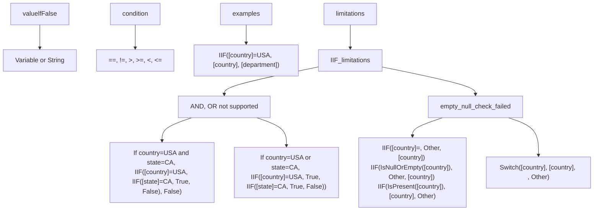

| Name           | Required/ Repeating | Type             | Notes                                                   |
| -------------- | ------------------- | ---------------- | ------------------------------------------------------- |
| valuelfFalse   | Required            | Variable or String | If the condition evaluates to false, the returned value. |

The following comparison operators can be used in the condition:

· Equal to (=) and not equal to (<>)

· Greater than (>) and greater than equal to (>=)

· Less than (<) and less than equal to (<=)

Example: Set the target attribute value to source country attribute if country="USA", else set target attribute value to source department attribute. IIF([country]="USA", [country] , [department])

# Known limitations

This section includes limitations and workarounds for the IIF function. For information about troubleshooting user creation issues, see Creation fails due to null / empty values.

. The IIF function currently doesn't support AND and OR logical operators.

. To implement AND logic, use nested IIF statement chained along the trueValue path. Example: If country="USA" and state="CA", return value "True", else return "False". IIF([country]="USA", IIF([state]="CA","True", "False"), "False")

· To implement OR logic, use nested IIF statement chained along the falseValue path. Example: If country="USA" or state="CA", return value "True", else return "False". IIF([country]="USA", "True", IIF([state]="CA","True", "False"))

. If the source attribute used within the IIF function is empty or null, the condition check fails.

o Unsupported IIF expression examples:
  o IIF([country]="", "Other", [country])
  o IIF(IsNullOrEmpty([country]), "Other", [country])
  o IIF (IsPresent([country]), [country], "Other")

o Recommended workaround: Use the Switch function to check for empty/null values. Example: If country attribute is empty, set value "Other". If it is present, pass the country attribute value to target attribute.

  o Switch([country], [country], "", "Other")

