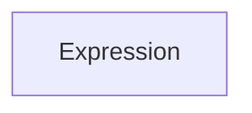

<!-- PageHeader="Function: IsNullOrEmpty(Expression)" -->

Description: If the expression is null or an empty string, then the IsNullOrEmpty function returns true. For an attribute, this would evaluate to True if the attribute is absent or is present but is an empty string. The inverse of this function is named IsPresent.

Parameters:

*Figure description: A table with four columns: "Name," "Required/Repeating," "Type," and "Notes." The only row contains:*
- *Name: "Expression"*
- *Required/Repeating: "Required"*
- *Type: "Expression"*
- *Notes: "Expression to be evaluated"*

Example: IsNullOrEmpty([displayName])

Returns True if the attribute isn't present or is an empty string.

# IsPresent

Function: IsPresent(Expression)

Description: If the expression evaluates to a string that isn't Null and isn't empty, then the IsPresent function returns true. The inverse of this function is named IsNullOrEmpty.

Parameters:

*Figure description: A table with four columns: "Name," "Required/Repeating," "Type," and "Notes." The only row contains:*
- *Name: "Expression"*
- *Required/Repeating: "Required"*
- *Type: "Expression"*
- *Notes: "Expression to be evaluated"*

Example: Switch (IsPresent([directManager]), [directManager], IsPresent([skiplevelManager]), [skiplevelManager], IsPresent([director]), [director])

## IsString

Function: IsString(Expression)

Description: If the expression can be evaluated to a string type, then the IsString function evaluates to True.

Parameters: