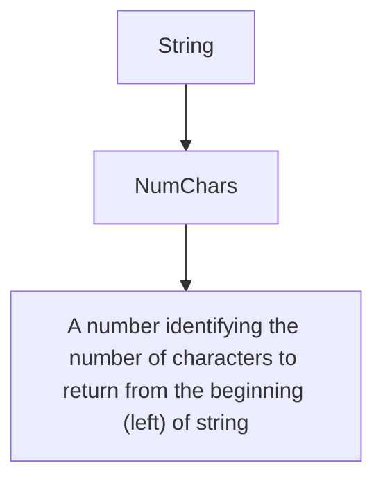
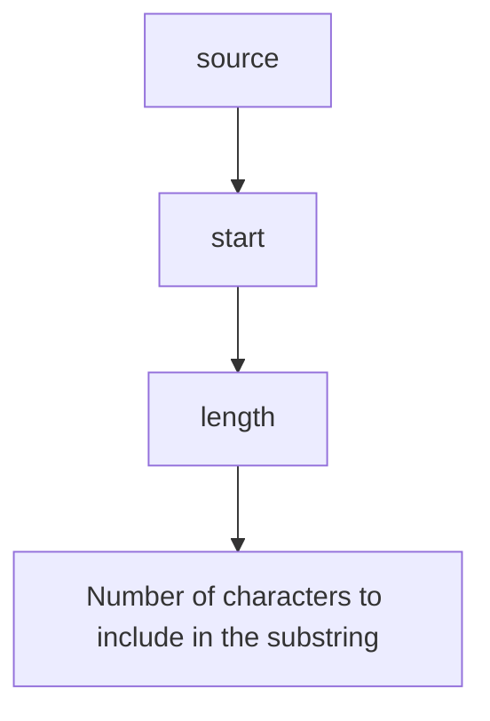

| Name | Required/ Repeating | Type | Notes |
| - | - | - | - |
| source1 ... sourceN | Required, variable- number of times | String | String values to be joined together. |

# Left

Function: Left(String, NumChars)

Description: The Left function returns a specified number of characters from the left of a string. If numChars = 0, return empty string. If numChars < 0, return input string. If string is null, return empty string. If string contains fewer characters than the number specified in numChars, a string identical to string (that is, containing all characters in parameter 1) is returned.

Parameters:

**Figure 1: Parameters table for the Left function**

| Name | Required/ Repeating | Type | Notes |
| - | - | - | - |
| String | Required | Attribute | The string to return characters from |
| NumChars | Required | Integer | A number identifying the number of characters to return from the beginning (left) of string |

Example: Left("John Doe", 3)

Returns "Joh".

# Mid

Function: Mid(source, start, length)

Description: Returns a substring of the source value. A substring is a string that contains only some of the characters from the source string.

Parameters:

**Figure 2: Parameters table for the Mid function**

