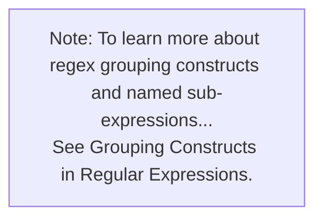

· When oldValue and replacementValue are provided:

  o Replaces all occurrences of oldValue in the source with replacementValue

· When oldValue and template are provided:

  o Replaces all occurrences of the oldValue in the template with the source value

· When regexPattern and replacementValue are provided:

  o The function applies the regexPattern to the source string and you can use the regex group names to construct the string for replacementValue

![Graphic of Note: To learn more about regex grouping constructs and named sub-expressions, see Grouping Constructs in Regular Expressions.]

· When regexPattern, regexGroupName, replacementValue are provided:

  o The function applies the regexPattern to the source string and replaces all values matching regexGroupName with replacementValue

· When regexPattern, regexGroupName, replacementAttributeName are provided:

  o If source has a value, source is returned
  o If source has no value, the function applies the regexPattern to the replacementAttributeName and returns the value matching regexGroupName

Parameters:

| Name              | Required/ Repeating | Type   | Notes                                                                                                           |
|-------------------|---------------------|--------|-----------------------------------------------------------------------------------------------------------------|
| source            | Required            | String | Usually name of the attribute from the source object.                                                           |
| oldValue          | Optional            | String | Value to be replaced in source or template.                                                                     |
| regexPattern      | Optional            | String | Regex pattern for the value to be replaced in source. When replacementAttributeName is used, the regexPattern is applied to extract a value from replacementAttributeName. |
| regexGroupName    | Optional            | String | Name of the group inside regexPattern. When named replacementAttributeName is used, we'll extract the value of the named regex group from the replacementAttributeName. |