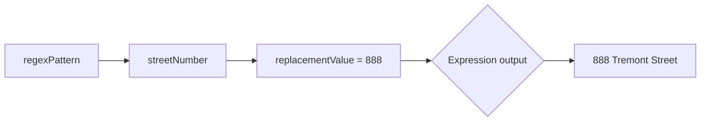

· regexPattern: "( ?< streetNumber>^\\\\d\*) "

· regexGroupName: "streetNumber"

· replacementValue: "888"

· Expression output: 888 Tremont Street

[Figure: Text description of how to replace a street number via regex pattern]



Here is another example where the domain suffix from a UPN is replaced with an empty string to generate login ID without domain suffix.

Replace([userPrincipalName], , "( ?< Suffix>@(.)\*)", "Suffix", "", , )

· source: [userPrincipalName] ="jsmith@contoso.com"

· regexPattern: " (?‹Suffix>@(.)\*) "

· regexGroupName: "Suffix"

· replacementValue: "" (empty string)

· Expression output: jsmith

[Figure: Text description of how to replace domain suffix from UPN via regex pattern]

```mermaid
graph TD;
    F[source] --> G[jsmith@contoso.com];
    H[regexPattern] --> I[Suffix];
    I --> J[replacementValue = ""];
    J --> K{Expression output};
    K --> L[jsmith];
```

Example 5: Using regexPattern, regexGroupName and replacementAttributeName to handle scenarios when the source attribute is empty or doesn't have a value.

Let's say your source system has an attribute telephoneNumber. If telephoneNumber is empty, you want to extract the 10 digits of the mobile number attribute. Then in this case, you can use the following expression in your attribute mapping.

Replace([telephoneNumber], , "\\\\+( ?< isdCode>\\\\d\* )( ?< phoneNumber>\\\\d{10})", "phoneNumber" , , [mobile], )

· source: [telephoneNumber] = "" (empty string)

· regexPattern: "\\\\+( ?< isdCode>\\\\d\* )( ?< phoneNumber>\\\\d{10})"

· regexGroupName: "phoneNumber"

· replacementAttributeName: [mobile] = "+91 8887779999"

· Expression output: 8887779999

[Figure: Text description of how to replace telephone number via regex pattern]

```mermaid
graph TB;
    M[source] --> N[empty string];
    O[regexPattern] --> P[phoneNumber];
    P --> Q[replacementAttributeName = "+91 8887779999"];
    Q --> R{Expression output};
    R --> S[8887779999];
```

Example 6: You need to find characters that match a regular expression value and remove them.

Replace([mailNickname], , "[a-zA-Z\_]\*" و , , )

· source [mailNickname]

· oldValue: "john\_doe72"

· replaceValue: ""

· Expression output: 72

[Figure: Text description of how to remove characters matching regular expression]

```mermaid
graph TB;
    T[source] --> U[oldValue john_doe72];
    V[replaceValue] --> W[""];
    W --> X{Expression output};
    X --> Y[72];
```